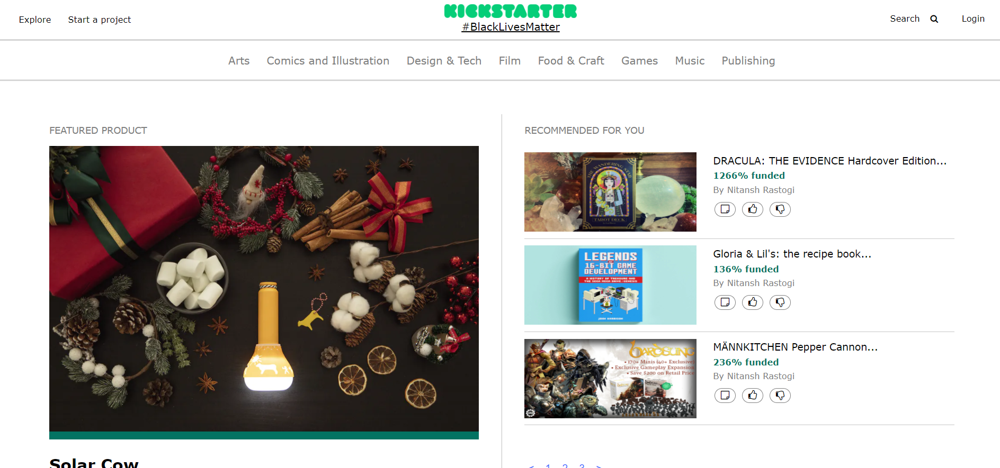

# Hydrogen
Our team name is ‘Hydrogen’ which consists of 3 team members:
* Nitansh Rastogi
* Arshad Ali
* Sohail Shaik
# Project Detail:
Cloned User Interface of some pages of a Crowdfunding Website : KickStarter.com

# Technologies used:
* HTML
* CSS
* JavaScript
# Following pages of the website are cloned:
* Homepage
* ‘Start a project’ Page
* Newsletter Page
* Helpcenter Page
* Login Page
* and, 8 Category Pages (Only top section dynamically using JavaScript)
# 1. Homepage
Features:
* Responsive
* Implemented Pagination Using JavaScript
* Implemented Slideshow for articles list

# 2. ‘Start a project’ Page: With embedded youtube video.

# 3. Newsletter Page:

# 4. Helpcenter Page:

# 5. Login Page:

# 6. Category Pages:

Hope you liked the user interface, there is always room for improvement and we sure will improve this project further.

